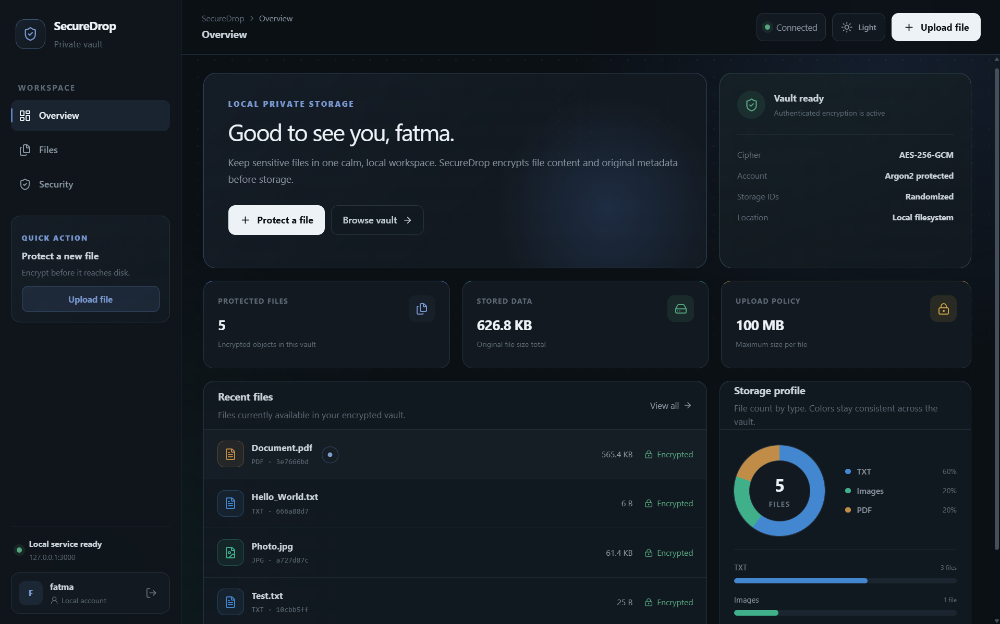

# SecureDrop || 🔐

A local-first encrypted file vault built with **Rust + Axum** and **React + TypeScript + Vite**.

<p align="center">
  
</p>

SecureDrop encrypts the original filename, original file size, and file bytes into an AES-256-GCM package before writing an opaque `.enc` object to disk. The interface then decrypts metadata locally for the signed-in user.

## 🛡️ Highlights 

- AES-256-GCM authenticated encryption
- Original filename encrypted at rest
- Random 128-bit storage identifiers
- 100 MB per-file upload limit
- Single local account with Argon2 password hashing
- In-memory authenticated sessions with an 8-hour lifetime
- Drag-and-drop upload
- Search, type filters, sorting, download, and delete confirmation
- Dark and light themes
- Storage distribution donut + category bars
- Security page with at-rest storage comparison
- Responsive desktop/mobile navigation
- Production mode can serve the built React app directly from Axum

## ↕️ Project Structure 

```text
SecureDrop/
├── src/
│   ├── main.rs
│   ├── api.rs
│   ├── auth.rs
│   ├── crypto.rs
│   └── storage.rs
├── frontend/
│   ├── src/
│   ├── public/
│   └── vite.config.ts
├── Cargo.toml
├── README.md
└── SECURITY.md
```

Private runtime files are intentionally excluded from Git:

```text
secret.key
auth.json
secure_files/
frontend/node_modules/
frontend/dist/
target/
```

## 🧩 Development 

### 1. Rust backend

From the project root:

```powershell
cargo run
```

The backend listens only on:

```text
http://127.0.0.1:3000
```

### 2. React frontend

In a second terminal:

```powershell
cd frontend
npm install
npm run dev
```

Open:

```text
http://localhost:5173
```

Vite proxies `/api` requests to the local Rust service, so no permissive CORS configuration is required.

## 🗂️ Production-Style Local Run

Build the frontend once:

```powershell
cd frontend
npm install
npm run build
cd ..
```

Then start Rust:

```powershell
cargo run
```

Open:

```text
http://127.0.0.1:3000
```

Axum serves `frontend/dist` and the API from the same local origin.

## 🚀 First Launch

On the first launch, SecureDrop asks you to create one local account.

- The password is hashed with Argon2.
- `auth.json` stores the username and password hash, not the plaintext password.
- A successful login creates an in-memory session token.
- Sessions expire after 8 hours and are cleared when the Rust process restarts.
- There is no password recovery in v1.0.

## 🗄️ Storage Model 

A user-facing file such as:

```text
thesis-notes.txt
```

is stored on disk under a randomized identifier such as:

```text
882ffe11700307d44d6eb4a8a087a817.enc
```

Inside the encrypted package are:

```text
original filename
original file size
original file bytes
```

The UI shows the original name only after the local Rust service decrypts the metadata.

## ⚠️ Important Migration Note

If you move the project to another folder and want to keep existing encrypted files, keep **both**:

```text
secret.key
secure_files/
```

Without the original `secret.key`, previously encrypted objects cannot be decrypted.

If you also want to keep the same local login, copy:

```text
auth.json
```

These files should never be committed to a public repository.

## ✅ Verification Before Publishing

```powershell
cargo check
cd frontend
npm run build
npm run lint
```

Then test:

- account setup and login
- upload
- download/decrypt
- delete
- duplicate filenames
- search/filter/sort
- 100 MB rejection
- dark/light mode
- backend restart and re-login

## 🔐 Security Scope

SecureDrop v1.0 is a local, single-account educational vault. It does **not** claim to provide cloud sync, remote password recovery, multi-user authorization, protection from malware on the host machine, or protection if an attacker can read `secret.key`.

See [SECURITY.md](SECURITY.md) for the threat model and limitations.

---

## 📬 Contact 

Fatma Susam 

[](https://github.com/fatmaSsm)
[](https://www.linkedin.com/in/fatma-susam/)

---
